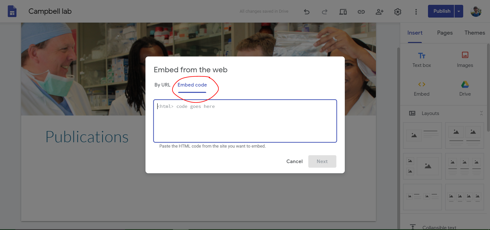
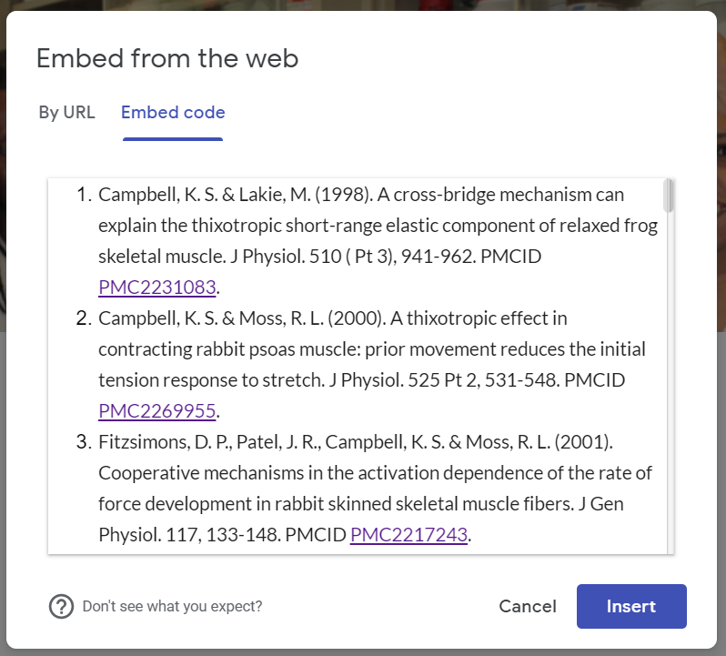

# PMC/PM Link Inserter

This repo houses a script to format citations in an HTML ordered list and insert the links for any PMC/PM IDs found in the citations.

## How To Use This Repo

### Generating the HTML Formatted Citations

To generate the HTML formatted citations:
1. Save the unformatted citations either as a numbered list or with each citation on a new line in a TXT file, like so:
    + Numbered list:
        > 1) Campbell, K. S. & Lakie, M. (1998). A cross-bridge mechanism can explain the thixotropic short-range elastic component of relaxed frog skeletal muscle. J Physiol. 510 ( Pt 3), 941-962. PMCID PMC2231083.
        > 2) Campbell, K. S. & Moss, R. L. (2000). A thixotropic effect in contracting rabbit psoas muscle: prior movement reduces the initial tension response to stretch. J Physiol. 525 Pt 2, 531-548. PMCID PMC2269955.
        > 3) Fitzsimons, D. P., Patel, J. R., Campbell, K. S. & Moss, R. L. (2001). Cooperative mechanisms in the activation dependence of the rate of force development in rabbit skinned skeletal muscle fibers. J Gen Physiol. 117, 133-148. PMCID PMC2217243.
    + New-line-delimited:
        > Campbell, K. S. & Lakie, M. (1998). A cross-bridge mechanism can explain the thixotropic short-range elastic component of relaxed frog skeletal muscle. J Physiol. 510 ( Pt 3), 941-962. PMCID PMC2231083.
        > Campbell, K. S. & Moss, R. L. (2000). A thixotropic effect in contracting rabbit psoas muscle: prior movement reduces the initial tension response to stretch. J Physiol. 525 Pt 2, 531-548. PMCID PMC2269955.
        > Fitzsimons, D. P., Patel, J. R., Campbell, K. S. & Moss, R. L. (2001). Cooperative mechanisms in the activation dependence of the rate of force development in rabbit skinned skeletal muscle fibers. J Gen Physiol. 117, 133-148. PMCID PMC2217243.
2. Open an Anaconda Prompt. There's no need to activate any kind of environment since the Python code in this repo doesn't use any modules outside of the standard library.
3. Navigate to the `src` directory in this repository.
4. Execute the PMC/PM link inserter script by typing the following in the Anaconda Prompt:
    ```
    python citation_formatter.py <LOCATION_OF_UNFORMATTED_CITATIONS>
    ```
    where `<LOCATION_OF_UNFORMATTED_CITATIONS>` is the file path to the TXT file containing the unformatted citations.

    This saves the formatted citations in `pmc_link_insertion\output\output.html`.

### Inserting the Formatted Citations Into Google Sites

Now that we have generated the formatted citations in `output\output.html`, we can insert the HTML code into Google Sites. To do this:

1. Open a Chrome browser and navigate to https://sites.google.com
2. Click on the "Campbell lab" Google Site.
    
3. Click on the "Publications" tab.
    
4. Delete the old list of citations by scrolling down the page, hovering over the text box containing the citations, and clicking the garbage bin icon.
    
5. Add an embeded snippet of code by clicking on the "Embed" icon on the right hand side of the page.
    
6. In the dialog box that opens, click the "Embed code" tab then copy and paste the generated HTML code found in `output\output.html` into the dialog box. Once copy/pasted, click "Next"
    
7. Preview the text in the dialog box to ensure that it looks correct, then click "Insert".
    
8. Resize the text box to fit the page. This will likely involve some repeated dragging/dropping at the bottom edge of the text box since our PI is so prolific :).